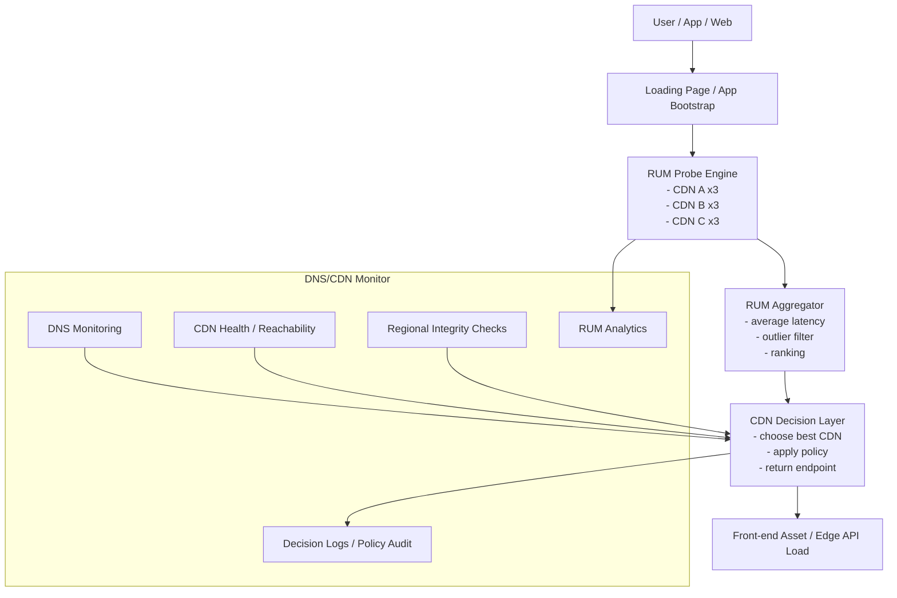

# DNS/CDN Monitor — Context

## 專案範圍

`01-DNS-Monitoring/` 為 DNS / Domain / CDN / Edge Monitoring 領域專案。

本輪任務將此專案對外定位統一為：
- **架構名稱**：`DNS/CDN Monitor`
- **目錄名稱**：維持 `01-DNS-Monitoring/`

`GlobalpingChecker` 視為此專案底下的子模組，不再作為平行主類別。

目前專案範圍涵蓋：
- Domain / DNS Monitoring
- Regional DNS Integrity Checks
- Multi-NS / HA 驗證
- Host DNS / authoritative / recursive architecture research
- CDN / DNS failover related runbooks
- 未來納入 Multi-CDN RUM-based routing architecture

## 當前任務規格

## 任務：將 01-DNS-Monitoring 重新定位為 DNS/CDN Monitor
- 目標：將既有 DNS 監控、區域探測、HA 驗證與 CDN 相關能力收斂成單一架構名稱 `DNS/CDN Monitor`，作為後續文件、規劃與平台整合的一致對外定位。
- 方法：保留現有資料夾名稱 `01-DNS-Monitoring/`，先在 planning / README / 架構文件層統一命名與邊界，再視後續需要決定是否真的重構實體目錄結構。
- 驗證：存在 `.planning/CONTEXT.md`、`ROADMAP.md`、`STATE.md`，且文件中明確說明 `GlobalpingChecker` 為子模組、`DNS/CDN Monitor` 為統一架構名稱。
- 影響範圍：`01-DNS-Monitoring/.planning/`、未來相關 README / 架構文件。

## 任務：規劃 Multi-CDN + RUM 動態選路架構
- 目標：建立一套由網站或 App 在 Loading 階段執行 RUM 探測、測量多個 CDN 實際速度、每個 CDN 執行 3 次測試並取平均，再挑選最快 CDN 提供前端使用的架構設計。
- 方法：先以架構與規格文件方式定義 RUM probe layer、decision layer、policy layer、observability layer、fallback strategy 與 data model；不直接實作正式前後端或 CDN provider 整合。
- 驗證：ROADMAP 與 STATE 中明確列出架構階段、User Story、Acceptance Criteria、風險與影響範圍。
- 影響範圍：`01-DNS-Monitoring/.planning/`，未來可能擴及 `domain-monitoring-system/`、`GlobalpingChecker/`、前端 / App probe SDK、control plane 文件。

## DNS/CDN Monitor 能力地圖

### A. Monitoring Capabilities
- Domain / DNS availability monitoring
- Regional DNS integrity checks
- Multi-NS / HA validation
- CDN reachability / health monitoring
- DNS / CDN failover runbook knowledge

### B. Decisioning Capabilities
- Multi-CDN candidate management
- RUM probe execution
- CDN ranking / latency aggregation
- policy-based CDN selection
- fallback / rollback decisioning

### C. Observability Capabilities
- probe result collection
- CDN selection logs
- regional / ISP performance analytics
- fallback reason tracking
- decision quality review

### D. Governance Capabilities
- recommendation-first routing policy
- safety guardrails for rollout
- config / policy versioning
- audit trail for routing decisions
- phased enablement by app / region / asset type

## Multi-CDN + RUM 高階架構



## 資料流規格

### Step 1 — Bootstrap
- 使用者進入網站或 App
- Loading 階段載入 RUM probe config
- config 內包含候選 CDN、測試 URL、timeout、sampling policy

### Step 2 — Probe
- 對每個候選 CDN 執行 3 次探測
- 建議探測對象為小型靜態檔或 lightweight endpoint
- 每次測試應盡量避免快取污染，必要時加 cache-busting nonce

### Step 3 — Aggregate
- 針對單一 CDN 計算 3 次測試的平均 latency
- 視需要去除極端值或 timeout contaminated result
- 形成 candidate ranking

### Step 4 — Decide
- 套用 decision policy：
  - CDN 必須健康
  - 若區域性封鎖 / 完整性異常則排除
  - 若 probe 失敗則使用 fallback CDN
- 輸出最佳 CDN endpoint

### Step 5 — Load & Observe
- 前端使用最佳 CDN 載入資源
- 將 probe result、selected CDN、fallback reason 回傳分析層
- 進入後續 performance analytics / policy tuning

## 前端 / App 啟動模式

### Mode A — Client-side Decision
- 前端自行測量並直接決策
- 優點：貼近使用者真實網路
- 缺點：策略控管弱、可觀測性較分散

### Mode B — Client Probe + Server-assisted Decision
- 前端測量後送回 decision service，由後端決定最佳 CDN
- 優點：策略集中治理、可記錄與回看
- 缺點：增加一次 decision roundtrip

### Mode C — Hybrid
- 前端先做暫時決策，後端持續學習並回寫 policy / session decision
- 優點：兼顧即時性與治理能力
- 建議：作為中長期正式方案

## 建議導入方向

### MVP
- client probe + local ranking + server logging
- 前端本地選最快 CDN
- 後端先記錄 probe / selection / fallback，不強制接管決策

### Beta
- client probe + server-assisted recommendation
- 後端開始套用 health / policy / regional rules，提供 recommendation 或 override suggestion

### Production
- hybrid decision model
- 支援資源類型分流（static / image / media / edge API）
- 支援分 region、ISP、app version、asset class 的精細 routing policy

## RUM Event Schema 草案

```json
{
  "event_id": "uuid",
  "timestamp": "2026-05-18T14:00:00Z",
  "session_id": "session-or-anonymous-token",
  "user_scope": {
    "region": "TW",
    "city": "Taipei",
    "isp": "Chunghwa Telecom",
    "network_type": "wifi",
    "device_type": "mobile",
    "platform": "web"
  },
  "app_context": {
    "app_name": "web-frontend",
    "app_version": "1.2.3",
    "asset_class": "static",
    "page_type": "loading"
  },
  "probe_policy": {
    "candidate_cdns": ["cdn-a", "cdn-b", "cdn-c"],
    "probe_count": 3,
    "timeout_ms": 1500,
    "strategy": "average-latency"
  },
  "probe_results": [
    {
      "cdn": "cdn-a",
      "attempts": [120, 140, 130],
      "average_latency_ms": 130,
      "success": true
    }
  ],
  "decision": {
    "selected_cdn": "cdn-a",
    "decision_mode": "client-local",
    "fallback_used": false,
    "fallback_reason": null,
    "policy_version": "v1"
  }
}
```

### Schema 欄位原則
- `region / city / isp`：支援地區與 ISP 維度分析
- `asset_class`：為未來 static / image / media / edge API 分流保留欄位
- `decision_mode`：區分 client-local、server-assisted、hybrid
- `fallback_reason`：記錄健康異常、timeout、policy block、integrity failure 等原因
- `policy_version`：支援 decision policy 比對與回溯

## Observability / Analytics 需求

### A. Probe-level Metrics
- CDN probe success rate
- average / p95 / p99 probe latency
- timeout rate
- outlier rate
- per-CDN probe failure distribution

### B. Decision-level Metrics
- selected CDN share by region / ISP / device
- fallback frequency
- decision override frequency
- decision confidence proxy（若未來導入 server-assisted recommendation）
- routing stability across repeated sessions

### C. Experience-level Metrics
- loading page total duration
- first byte / first asset load latency
- front-end bootstrap success rate
- rebuffer / retry / reload proxy metrics（若為 media / app case）

### D. Governance-level Metrics
- policy hit rate
- unhealthy CDN exclusion count
- integrity-blocked routing count
- recommendation adoption vs override ratio
- rollout blast radius by app / region / asset class

## Fallback / Policy / Rollout Guardrails

### Fallback 規則
1. 若單一 CDN 3 次 probe 全失敗，直接排除
2. 若所有候選 CDN 皆失敗，使用預設 fallback CDN
3. 若 probe 結果差異過大且不穩定，可退回 policy-preferred CDN
4. 若 DNS / CDN health 顯示 provider 異常，禁止被選用
5. 若 regional integrity check 顯示特定區域污染 / 封鎖，禁止該區域選用受影響路徑

### Policy Guardrails
- 不允許 probe endpoint 為大型正式資產
- 不允許第一版直接控制 production DNS 切流
- 不允許未經 review 的新 CDN provider 直接進入正式 candidate pool
- 不允許未標記 policy version 的 decision config 上線
- 不允許無 logging / 無 audit 的 decision mode 進入 Beta 以上環境

### Rollout Guardrails
- 先以單一 app / 單一網站導入
- 先以單一 asset class（建議 static）導入
- 先以 recommendation / logging 為主，不直接接管所有 routing
- 採 feature flag 分 region、ISP、platform、app version 漸進釋出
- 需要定義 rollback switch，可快速退回預設 CDN

## Downstream Integration Map

### 與 Front-end / App
- 載入 probe config
- 執行 probe script / SDK
- 回傳 probe result 與 selected CDN
- 以 feature flag 控制導入範圍

### 與 DNS/CDN Provider Layer
- 讀取 CDN health / reachability / provider metadata
- 未來可接 provider capability registry
- 第一版不直接操作正式 DNS / CDN traffic steering

### 與 DNS/CDN Monitor 後端
- 接收 RUM event
- 儲存 decision log
- 產生 analytics / regional insight
- 支援未來 recommendation API

### 與 Control Plane
- 顯示 region / ISP / CDN 決策分布
- 顯示 fallback 原因與 policy hit 情況
- 顯示 rollout feature flag 狀態
- 未來可提供 recommendation-only 的 CDN policy 建議

## DNS/CDN Monitor — MVP 實作規格草案

### MVP 目標
以 **client probe + local ranking + server logging** 模式，做出第一版可驗證閉環：
1. 前端 / App 在 Loading 階段對 3 個 CDN 候選做 3 次探測
2. 前端本地計算平均 latency 並選出最快 CDN
3. 前端使用該 CDN 載入 static assets
4. 將 probe / decision event 上送後端
5. 後端保存 decision log，供後續 analytics 與 control plane 使用

### MVP 非目標
- 不直接控制 production DNS 切流
- 不直接調用正式 CDN traffic steering API
- 不做跨 asset class 的複雜決策
- 不做 ML / adaptive routing
- 不做多步驟 server-side hard override

## MVP 模組分工

### 1. Front-end / App Probe SDK
**責任**：執行 probe、計算平均值、選擇最快 CDN、送出事件

建議承接方式：
- Web：由網站前端專案內嵌一個 lightweight JS probe module
- App：由 App bootstrap / splash/loading flow 內嵌一個 probe helper

### 2. `domain-monitoring-system`
**責任**：作為 MVP 的 event ingestion / logging backend 候選

建議原因：
- 已有應用程式與資料層輪廓
- 比 `GlobalpingChecker` 更適合作為事件接收與存放邊界
- 可延伸成 RUM event ingest + analytics API

### 3. `GlobalpingChecker`
**責任**：作為外部探測 / regional signal / validation data source 的輔助子模組

MVP 階段建議：
- 不承接主要 ingestion API
- 可在後續 Beta 階段用來交叉比對區域可達性、DNS / CDN regional anomaly

### 4. Control Plane
**責任**：顯示 decision log、fallback、region / ISP 分布與 policy 命中情況

MVP 階段建議：
- 先以 read-only dashboard 為主
- 不直接下發 routing override

## Probe SDK Contract

### Probe Config
```json
{
  "version": "v1",
  "app_name": "web-frontend",
  "asset_class": "static",
  "probe_count": 3,
  "timeout_ms": 1500,
  "candidates": [
    {
      "cdn": "cdn-a",
      "probe_url": "https://cdn-a.example.com/probe/pixel.png",
      "asset_base_url": "https://cdn-a.example.com/assets/"
    },
    {
      "cdn": "cdn-b",
      "probe_url": "https://cdn-b.example.com/probe/pixel.png",
      "asset_base_url": "https://cdn-b.example.com/assets/"
    }
  ],
  "fallback_cdn": "cdn-a"
}
```

### Probe Input Rules
- 每個 CDN 預設 probe 3 次
- probe object 應為小型靜態檔，建議 < 10 KB
- 必須支援 timeout
- 應支援 cache-busting query string，例如 `?t=<timestamp>&n=<nonce>`
- 若使用瀏覽器 API，需避免阻塞正式資產載入太久

### Probe Output Contract
```json
{
  "selected_cdn": "cdn-a",
  "decision_mode": "client-local",
  "probe_summary": [
    {
      "cdn": "cdn-a",
      "attempts_ms": [120, 130, 125],
      "average_latency_ms": 125,
      "success": true
    },
    {
      "cdn": "cdn-b",
      "attempts_ms": [180, 210, 190],
      "average_latency_ms": 193,
      "success": true
    }
  ],
  "fallback_used": false,
  "fallback_reason": null
}
```

## Decision API Contract

### API 1 — 取得 Probe Config
`GET /api/v1/cdn/probe-config`

#### Response
```json
{
  "version": "v1",
  "app_name": "web-frontend",
  "asset_class": "static",
  "probe_count": 3,
  "timeout_ms": 1500,
  "candidates": [
    {
      "cdn": "cdn-a",
      "probe_url": "https://cdn-a.example.com/probe/pixel.png",
      "asset_base_url": "https://cdn-a.example.com/assets/"
    }
  ],
  "fallback_cdn": "cdn-a",
  "policy_version": "v1"
}
```

### API 2 — 上送 RUM Decision Event
`POST /api/v1/cdn/rum-events`

#### Request
```json
{
  "session_id": "anon-session-token",
  "platform": "web",
  "app_name": "web-frontend",
  "app_version": "1.2.3",
  "asset_class": "static",
  "region": "TW",
  "city": "Taipei",
  "isp": "Chunghwa Telecom",
  "candidate_cdns": ["cdn-a", "cdn-b"],
  "probe_count": 3,
  "probe_summary": [
    {
      "cdn": "cdn-a",
      "attempts_ms": [120, 130, 125],
      "average_latency_ms": 125,
      "success": true
    }
  ],
  "selected_cdn": "cdn-a",
  "decision_mode": "client-local",
  "fallback_used": false,
  "fallback_reason": null,
  "policy_version": "v1",
  "event_ts": "2026-05-18T14:30:00Z"
}
```

#### Response
```json
{
  "accepted": true,
  "event_id": "uuid",
  "logging_mode": "ingest-only"
}
```

### API 3 — 未來 Beta 保留
`POST /api/v1/cdn/decide`

MVP 階段先不實作，只保留 contract 方向：
- request 帶 probe result
- response 回 recommendation / override / fallback
- 僅 Beta 後考慮啟用

## Event Ingestion Schema / Storage 邊界

### MVP 建議資料落點
- ingestion endpoint：`domain-monitoring-system`
- 儲存型態：先用 table / document-friendly schema 均可
- 第一版優先需求：
  - 可查詢時間範圍
  - 可查詢 region / ISP / CDN
  - 可查詢 fallback event
  - 可查詢 selected CDN distribution

### 最小欄位集合
- `event_id`
- `event_ts`
- `session_id`
- `platform`
- `app_name`
- `app_version`
- `asset_class`
- `region`
- `city`
- `isp`
- `candidate_cdns`
- `probe_count`
- `probe_summary`
- `selected_cdn`
- `decision_mode`
- `fallback_used`
- `fallback_reason`
- `policy_version`

## Feature Flag Model

### MVP 建議 flags
- `cdn_probe_enabled`
- `cdn_probe_regions_allowlist`
- `cdn_probe_platforms_allowlist`
- `cdn_probe_asset_classes_allowlist`
- `cdn_probe_sampling_rate`

### 啟用順序
1. internal / staging
2. 單一網站或單一 app
3. 單一 region
4. 小比例 sampling
5. 擴大到更多 region / ISP

## MVP 驗證方式

### Functional Validation
- 能成功取得 probe config
- 能對至少 2~3 個 CDN 候選執行 3 次 probe
- 能正確計算平均 latency 並選出最快 CDN
- 能在 probe 全失敗時切到 fallback CDN
- 能成功將 event POST 到 ingestion endpoint

### Data Validation
- 後端可查到 event
- event 包含 selected CDN、probe_summary、region / ISP、fallback_reason
- control plane 或報表可看出 selected CDN distribution

### Risk Validation
- probe 不可明顯拖慢 loading page
- probe timeout 應在可控範圍
- 不應造成資產載入循環依賴
- feature flag 關閉後應可立即退回預設 CDN 行為

## MVP 後續拆解建議
- Step 1：定義 `probe-config` 與 `rum-events` API mock schema
- Step 2：選定 `domain-monitoring-system` 是否承接 ingestion
- Step 3：建立 Web probe JS skeleton
- Step 4：建立 decision event logging pipeline
- Step 5：建立 read-only dashboard / report

## DNS/CDN Monitor — MVP 模組承接決策草案

### 決策原則
1. **最小改動優先**：優先掛載在已存在且最接近責任邊界的模組
2. **讀寫分離**：MVP 階段先讓前端 probe 負責 decision，後端主要負責 ingest / log / observe
3. **避免角色混淆**：不讓外部探測工具直接兼任主事件接收 API
4. **保留未來演進路徑**：MVP 的模組邊界需能平滑升級到 Beta 的 server-assisted recommendation
5. **避免新增過多新專案**：在未驗證價值前，不先建立新的獨立 control plane 或 decision service 專案

## 推薦承接方案（Recommended Option A）

### 1. Front-end / App Probe SDK
**承接位置**：各實際消費 CDN 的網站前端專案 / App 專案

**理由**：
- probe 與 decision 發生在使用者真實路徑上
- 最貼近 loading/bootstrap lifecycle
- 不應硬塞進 `01-DNS-Monitoring/` repo 內部做成假前端

**MVP 責任**：
- 取得 `probe-config`
- 執行 3 次 probe
- 本地計算平均 latency
- 選出最快 CDN
- 回傳 `rum-events`

### 2. `domain-monitoring-system`
**承接位置**：MVP ingestion API、event logging、analytics seed backend

**理由**：
- 已具備 application/backend 型輪廓
- 比 `GlobalpingChecker` 更適合當事件寫入與查詢邊界
- 後續可自然演進成 recommendation API / reporting backend

**MVP 責任**：
- 提供 `GET /api/v1/cdn/probe-config`
- 提供 `POST /api/v1/cdn/rum-events`
- 儲存 RUM decision logs
- 提供基礎查詢 / 匯總資料給 dashboard

### 3. `GlobalpingChecker`
**承接位置**：regional validation / external measurement sidecar

**理由**：
- 更適合做外部區域可達性、DNS / CDN health、cross-region 佐證
- 不適合在 MVP 階段兼任使用者端 RUM ingestion backend

**MVP 責任**：
- 暫不接主寫入 API
- 作為後續 Beta 的外部校正訊號來源
- 輔助判讀某 region 是否存在 provider 異常或污染

### 4. Control Plane
**承接位置**：沿用既有 control-plane / dashboard 概念，先做 read-only 視圖

**理由**：
- MVP 的目標是看得到 decision log 與 fallback 分布
- 不需要一開始就有可操作的 routing override

**MVP 責任**：
- 顯示 selected CDN distribution
- 顯示 fallback reason 統計
- 顯示 region / ISP / platform 分布
- 顯示 probe success / timeout 趨勢

## 替代方案（Option B）

### `GlobalpingChecker` 承接 ingestion API
**可行但不推薦作為第一選擇**

**優點**：
- 若該模組已偏向全球探測，可自然接 regional insight
- 某些 decision support 查詢可能更靠近它的能力

**缺點**：
- 會混淆「外部探測工具」與「MVP 事件接收後端」角色
- 若其現有資料模型偏 probe / checker，而非 app-side RUM ingest，會增加重構成本
- 容易讓 usage analytics 與 external validation 耦合過深

## 不建議方案（Option C）

### 直接新建獨立 `dns-cdn-decision-service`
**MVP 階段不建議**

**原因**：
- 專案數量再增加，治理成本上升
- 在尚未驗證 usage / value 前，過早拆微服務
- 目前需求仍偏 logging + analytics seed，而非高複雜 server-side routing orchestration

## 承接決策結論

### MVP 階段建議責任分配
- **Probe SDK**：由實際前端 / App 專案承接
- **Ingestion API / Logging Backend**：由 `domain-monitoring-system` 承接
- **Regional / External Validation Signals**：由 `GlobalpingChecker` 承接
- **Dashboard / Visualization**：由現有 control plane / dashboard 層承接

### Beta 階段演進方向
- `domain-monitoring-system` 增加 recommendation API
- `GlobalpingChecker` 與 DNS / CDN health data 融入 decision context
- control plane 開始支援 recommendation review，不直接下發 production override

### Production 階段演進方向
- 視規模與價值，再考慮是否獨立 decision service
- 僅在 recommendation / override / policy complexity 顯著增加後再拆服務

## 決策風險與注意事項

### 風險 1：`domain-monitoring-system` 與 RUM ingest 邊界不完全匹配
- 緩解：先以最小 API / event table 驗證，不一次重構整個系統

### 風險 2：前端 probe SDK 落在外部專案，與本 repo 分離
- 緩解：先在 planning 中固定 contract，再由消費端專案實作

### 風險 3：Control Plane 與 DNS/CDN Monitor repo 不一定同倉
- 緩解：MVP 只要求 read-only aggregate view，不要求同 repo 完整整合

### 風險 4：`GlobalpingChecker` 子模組定位仍可能漂移
- 緩解：文件明確限制其在 MVP 僅做 validation / signal source，不承接主 ingestion

## 建議的下一個執行步驟
1. 讀 `domain-monitoring-system/` 現況，確認最適合放 `probe-config` / `rum-events` 的 API 模組位置
2. 為 `domain-monitoring-system` 補一份 MVP API 落點規格
3. 為 Web 端補一份 probe JS skeleton spec
4. 再決定是否進入實作

## DNS/CDN Monitor — domain-monitoring-system API 落點規格

### 現況盤點
目前 `domain-monitoring-system` 具備以下結構特徵：
- API 入口集中在 `app/main.py`
- 資料模型集中在 `app/models.py`
- Pydantic schema 集中在 `app/schemas.py`
- DB session 由 `app/database.py` 提供
- 目前尚未拆成獨立 router / service package，屬於單一 FastAPI app + module layout

### API 落點設計原則
1. **MVP 先遵循現有單檔入口模式**：先把新 endpoint 掛進 `app/main.py`，避免過早重構 router 架構
2. **Schema 與 Model 正式分層**：request/response 進 `schemas.py`，資料表進 `models.py`
3. **事件型資料優先沿用現有 event/log 風格**：優先評估延伸 `MonitoringEvent` 或新增 `RUMDecisionEvent` 專用模型
4. **先最小可行，後續再抽 service**：若 API 成熟再拆 `app/services/cdn_routing.py` 或 `app/routers/cdn.py`

## 推薦落點（MVP）

### 1. `GET /api/v1/cdn/probe-config`
**Route 落點**：`app/main.py`

**原因**：
- 現有所有 API 都直接定義在 `main.py`
- 此端點屬於薄型 config response，MVP 不需先抽 router
- 方便先快速驗證前端 probe contract

**配套 schema**：`app/schemas.py`
建議新增：
- `CDNProbeCandidate`
- `CDNProbeConfigResponse`

**資料來源建議**：
- MVP 第一版可先用 settings / static config / in-code config
- 不必一開始就進資料庫
- 若後續需要分 app / region / asset_class，再升級成 DB-backed config

### 2. `POST /api/v1/cdn/rum-events`
**Route 落點**：`app/main.py`

**原因**：
- 與現有 `/api/check/dns`、`/api/events` 類型相近，屬 ingestion-style endpoint
- 可直接共用 `get_db()` dependency
- 先走同步寫入，後續再考慮 background task / Celery

**配套 schema**：`app/schemas.py`
建議新增：
- `CDNProbeSummaryItem`
- `CDNRUMEventCreate`
- `CDNRUMEventResponse`

## Storage 落點決策

### 選項 A：延伸既有 `MonitoringEvent`
**MVP 推薦首選**

**做法**：
- 在 `MonitoringEvent.event_type` 新增一種值，例如 `cdn_rum_decision`
- 將 RUM event 寫進 `details` JSONB
- `status` 可使用 `ok` / `warning` 對應正常 decision / fallback decision
- `domain_id` 可先允許對應到邏輯上的主 domain / app domain

**優點**：
- 不需第一時間新增新表
- 與現有 event log 風格一致
- 方便快速查詢與 dashboard 復用

**缺點**：
- RUM event 與 DNS event 混在同表，長期可能需要分流
- `domain_id` 對 app-side RUM 來說語意未必完美

### 選項 B：新增 `RUMDecisionEvent` 專用表
**Beta 後建議考慮**

**做法**：
- 在 `models.py` 新增專用資料表
- 以明確欄位存 `session_id`、`region`、`isp`、`selected_cdn`、`fallback_used` 等

**優點**：
- 查詢與分析更乾淨
- 不會污染既有 monitoring event

**缺點**：
- 需要 migration
- MVP 開發成本較高

### 結論
MVP 階段建議先採：
- **Route**：`app/main.py`
- **Schema**：`app/schemas.py`
- **Storage**：優先延伸 `MonitoringEvent`，以 `event_type = "cdn_rum_decision"` 存放於 `details`

## Service 落點建議

### MVP 第一版
先不新增 service module，直接在 `main.py` 中：
- 驗證 request schema
- 組裝 `MonitoringEvent(details=...)`
- 寫入 DB
- 回傳 `accepted/event_id`

### 第二步可抽出
若 endpoint 穩定，可再抽：
- `app/cdn_rum_service.py`
或未來更完整地改成：
- `app/services/cdn_rum.py`
- `app/routers/cdn.py`

## 具體檔案落點建議

### `app/main.py`
新增：
- `GET /api/v1/cdn/probe-config`
- `POST /api/v1/cdn/rum-events`
- 可選 `GET /api/v1/cdn/rum-events` 查詢 endpoint（MVP 後段再考慮）

### `app/schemas.py`
新增：
- `CDNProbeCandidate`
- `CDNProbeConfigResponse`
- `CDNProbeSummaryItem`
- `CDNRUMEventCreate`
- `CDNRUMEventResponse`

### `app/models.py`
MVP 建議：
- 不新增新表
- 沿用 `MonitoringEvent`
- 僅在文件與程式邏輯上新增 `event_type = "cdn_rum_decision"`

### `app/config.py`
可選新增：
- `CDN_PROBE_ENABLED`
- `CDN_PROBE_TIMEOUT_MS`
- `CDN_PROBE_COUNT`
- `CDN_PROBE_CANDIDATES_JSON`
- `CDN_PROBE_FALLBACK_CDN`

## Forbidden / 暫不建議先碰的區域
- 不先重構整個 `main.py` 為多 router 架構
- 不先改 Celery pipeline
- 不先建立獨立 `RUMDecisionEvent` migration
- 不先做 server-assisted `POST /api/v1/cdn/decide`
- 不先把 decision policy 做成複雜 DB 管理後台

## 實作前驗證清單
1. `MonitoringEvent` 是否可接受 `domain_id` 對應到 CDN consumer domain
2. `details` JSONB 是否足夠容納 probe summary 與 decision metadata
3. `main.py` 現有 API 風格是否可接受再加兩個 endpoint
4. `config.py` 是否已有適合放 probe candidates 的設定模式
5. 若需 dashboard，是否先讀既有 `/api/events` 聚合即可滿足 MVP

## 建議的下一步
1. 為 `domain-monitoring-system/app/config.py`、`schemas.py`、`main.py` 產出具體欄位級 spec
2. 決定 `MonitoringEvent` 是否足夠承接 MVP event
3. 若足夠，再進入 mock endpoint implementation plan

## User Story
身為網站或 App 的終端使用者，我希望系統能在載入初期測量多個 CDN 的實際速度，並自動選擇對我當下最快的 CDN，以便降低載入延遲並提升穩定性。

## Acceptance Criteria
1. 架構規格明確定義 `DNS/CDN Monitor` 的定位，並將 `GlobalpingChecker` 收斂為其子模組。
2. 架構規格明確描述 Multi-CDN RUM probe 流程：每個 CDN 測 3 次、取平均值、回傳最佳 CDN。
3. 規格中明確區分 DNS monitoring、CDN monitoring、RUM decisioning、policy control 與 observability 的責任邊界。
4. 文件中明確定義 fallback / rollback 策略，以及當 probe 失敗、CDN 不健康、結果不一致時的處理方式。
5. 文件中明確列出第一版只做規劃，不直接實作 production routing、正式 CDN API、正式 App / Web SDK。

## API / Data Notes
- Input：DNS / CDN health、regional integrity signals、RUM probe results、policy rules、fallback rules
- Output：architecture docs、decision flow、phase roadmap、future data schema / API contract proposals
- Data Structure Changes：此輪先新增 planning 文件，不直接修改既有程式資料結構
- Estimated Impact：Medium to Large
- Downstream Affected Use Cases：CDN routing、front-end loading bootstrap、regional performance optimization、control plane recommendation
- Required Verification：manual review of planning docs and architecture consistency

## 技術限制

- 第一版僅做架構與規格，不直接連線正式 CDN provider、DNS provider 或 production App / Web client
- 不在此階段實作真實流量切換、正式 SDK、正式 edge routing 或生產環境策略
- Loading probe 設計必須考慮首屏成本，避免探測本身拖慢使用者體驗
- RUM 測速結果需考慮 cache、DNS resolver、瀏覽器 / App runtime 差異，不可直接假設單次測試等於真實長期最佳路徑

## Forbidden Zones

- 不直接重命名實體目錄 `01-DNS-Monitoring/`，避免破壞既有路徑與文件鏈結
- 不把 `GlobalpingChecker` 當成平行主專案重新拆離
- 不在規劃階段直接實作 production-grade Multi-CDN routing 或真實流量調度
- 不提交真實 CDN token、DNS credentials、edge routing secrets 或 App production endpoints
