# Host DNS Resolver 詳細流程圖

本文檔包含 Host DNS Resolver 系統的各個關鍵流程圖，使用 Mermaid 語法繪製。

## 目錄

1. [整體架構流程圖](#1-整體架構流程圖)
2. [DNS 請求處理流程](#2-dns-請求處理流程)
3. [來源 IP 保留流程](#3-來源-ip-保留流程)
4. [動態限流與防護流程](#4-動態限流與防護流程)
5. [快速復原流程](#5-快速復原流程)
6. [可觀測性數據流](#6-可觀測性數據流)
7. [部署流程](#7-部署流程)
8. [健康檢查流程](#8-健康檢查流程)

---

## 1. 整體架構流程圖

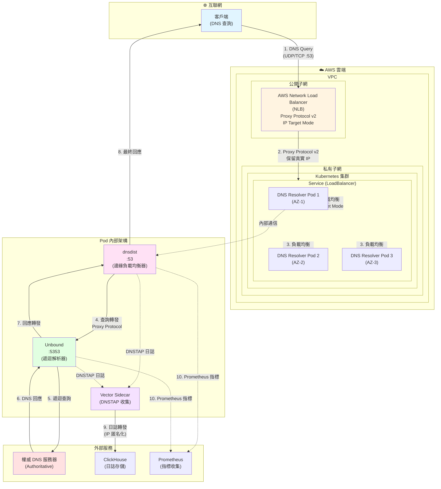

---

## 2. DNS 請求處理流程

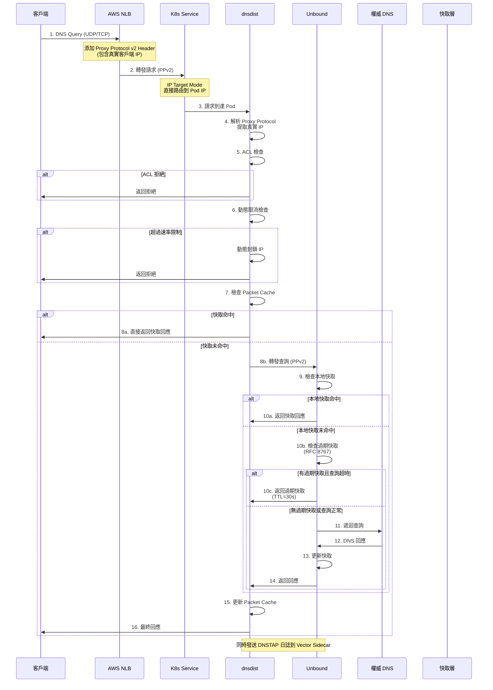

---

## 3. 來源 IP 保留流程

```mermaid
graph LR
    subgraph Client["客戶端"]
        C1["真實 IP:<br/>203.0.113.1"]
    end
    
    subgraph NLB["AWS NLB"]
        N1["接收請求<br/>來源: 203.0.113.1"]
        N2["添加 Proxy Protocol v2<br/>Header"]
    end
    
    subgraph K8s["Kubernetes"]
        K1["Service<br/>target-type: ip"]
        K2["直接路由到 Pod<br/>繞過 kube-proxy"]
    end
    
    subgraph Pod["Pod 內部"]
        P1["dnsdist 接收<br/>解析 PPv2 Header"]
        P2["提取真實 IP<br/>203.0.113.1"]
        P3["用於限流和 ACL"]
    end
    
    C1 -->|"1. DNS Query<br/>來源: 203.0.113.1"| N1
    N1 -->|"2. 封裝 PPv2"| N2
    N2 -->|"3. 轉發 (含 PPv2)"| K1
    K1 -->|"4. IP Target Mode<br/>保留封包"| K2
    K2 -->|"5. 直接到達 Pod"| P1
    P1 -->|"6. 解析 Header"| P2
    P2 -->|"7. 使用真實 IP"| P3
    
    style C1 fill:#e1f5ff
    style N2 fill:#fff4e1
    style P2 fill:#ffe1f5
    style P3 fill:#e1ffe1
```

**對比：不使用 Proxy Protocol 的情況**

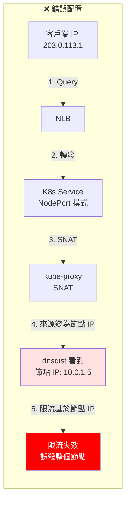

---

## 4. 動態限流與防護流程

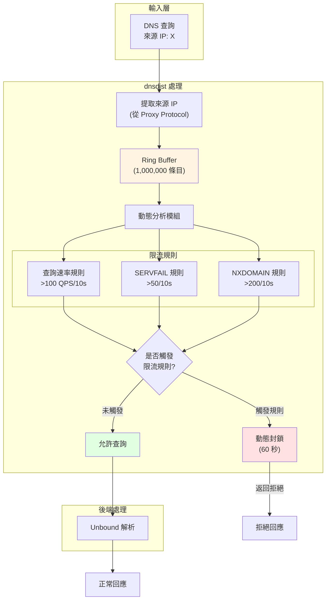

**Water Torture 攻擊防護流程**

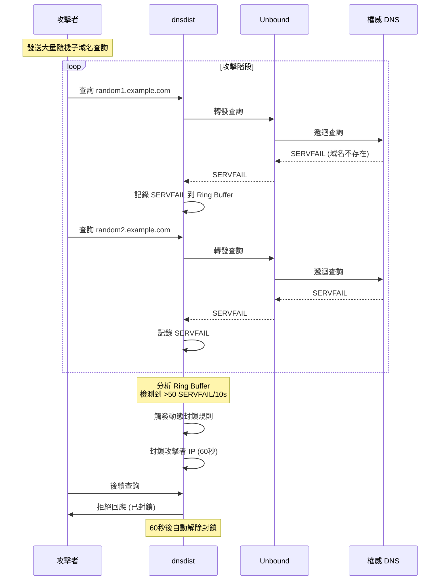

---

## 5. 快速復原流程

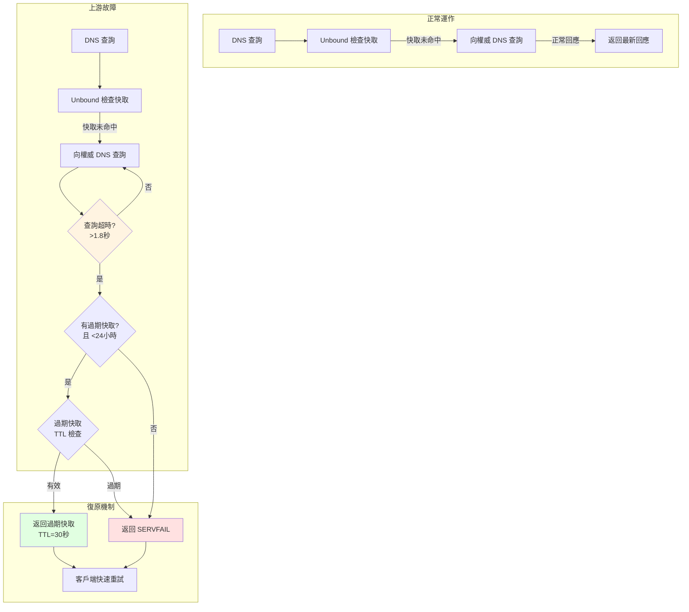

**RFC 8767 Serve Stale 詳細流程**

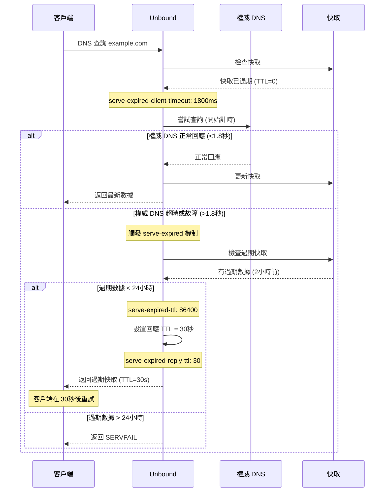

---

## 6. 可觀測性數據流

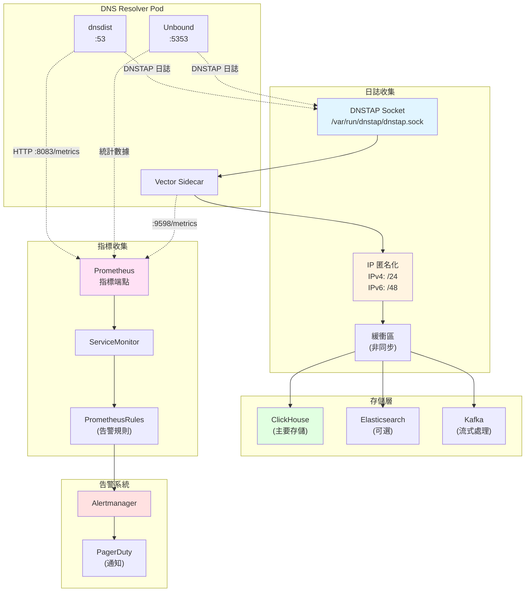

**DNSTAP 數據處理流程**

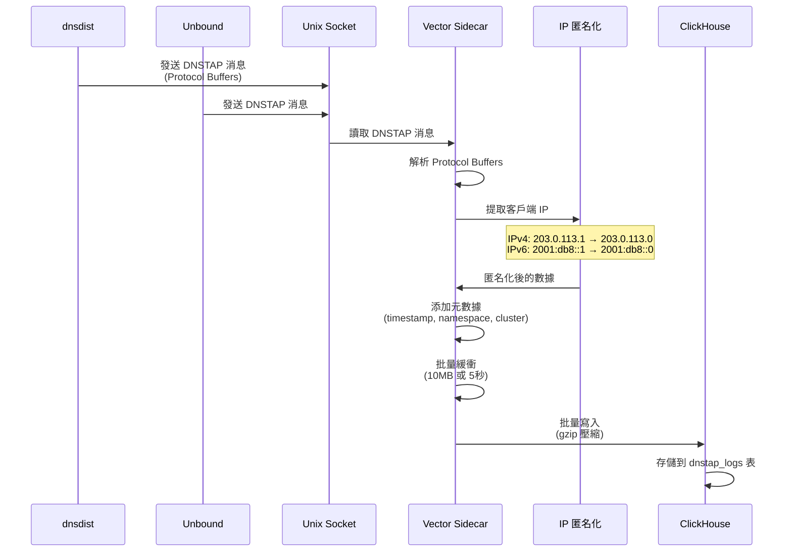

---

## 7. 部署流程

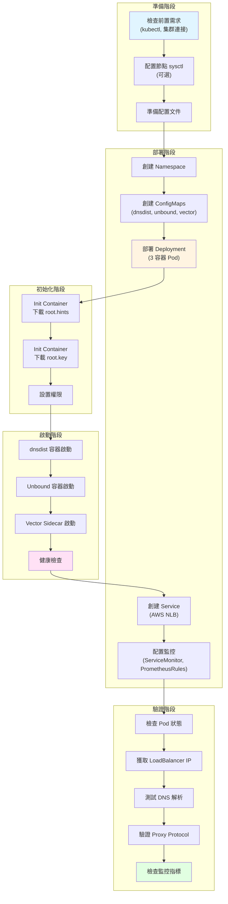

**詳細部署時序圖**

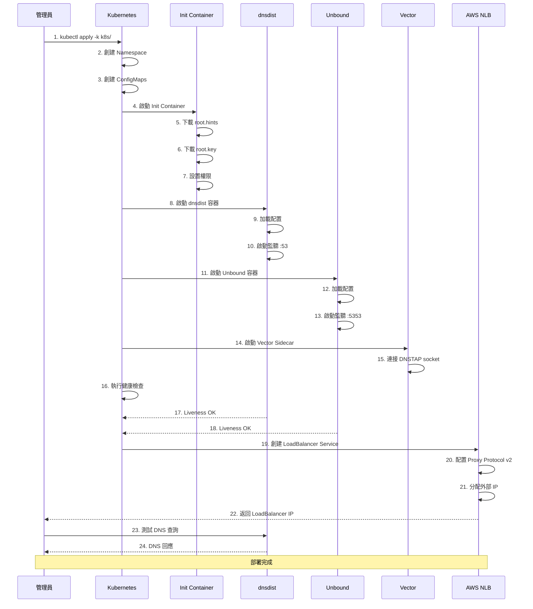

---

## 8. 健康檢查流程

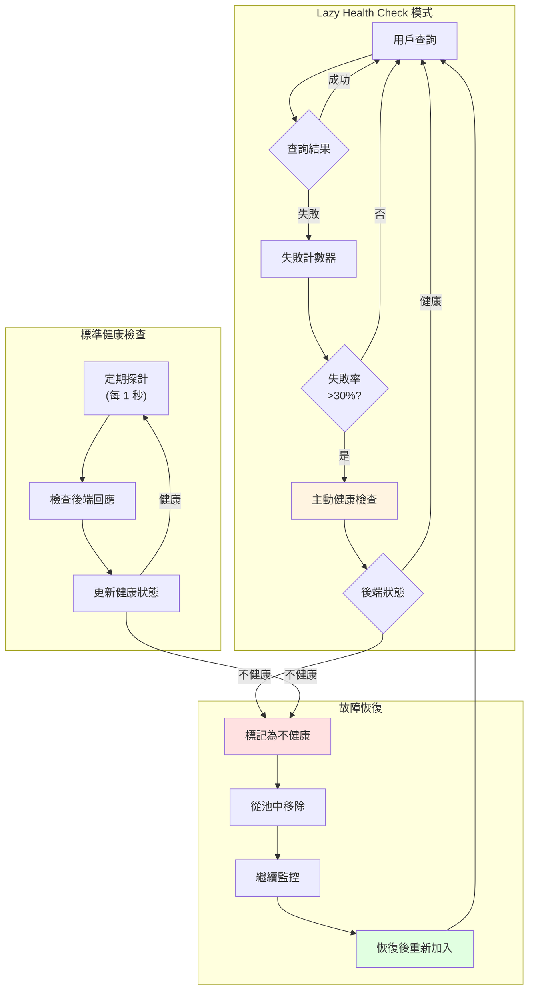

**健康檢查時序圖**

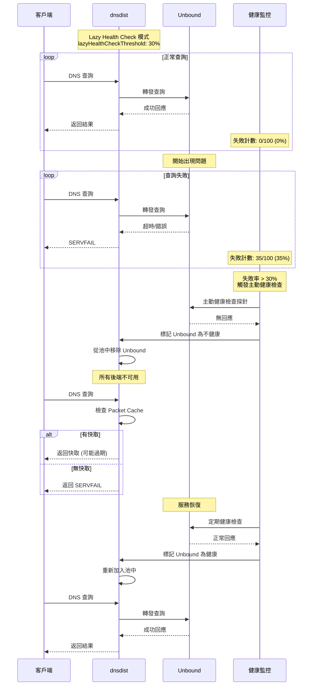

---

## 9. 快取策略流程

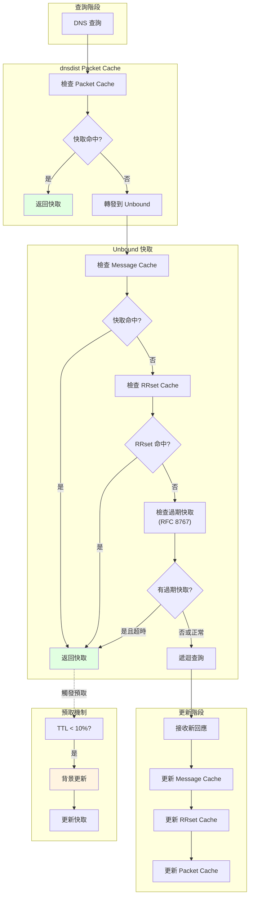

---

## 10. 告警流程

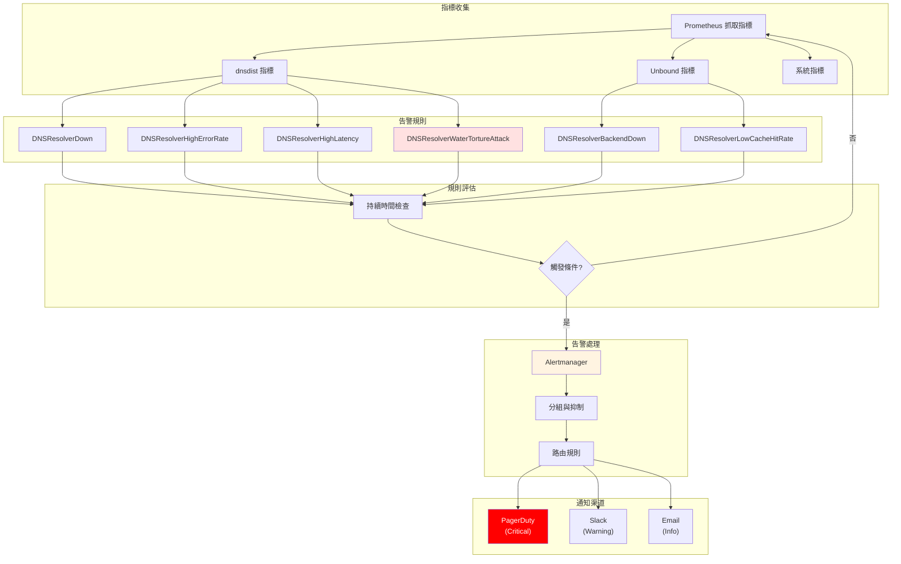

---

## 使用說明

這些流程圖使用 **Mermaid** 語法繪製，可以在以下環境中查看：

1. **GitHub/GitLab**: 直接渲染 Mermaid 圖表
2. **VS Code**: 安裝 Mermaid 擴展
3. **線上編輯器**: [Mermaid Live Editor](https://mermaid.live/)
4. **文檔工具**: MkDocs、Docusaurus 等支援 Mermaid 的工具

### 導出為圖片

可以使用以下工具將 Mermaid 圖表導出為圖片：

```bash
# 使用 mermaid-cli
npm install -g @mermaid-js/mermaid-cli
mmdc -i 流程圖.md -o 流程圖.png

# 或使用線上工具
# https://mermaid.live/
```

---

**版本**: v1.01  
**最後更新**: 2024

