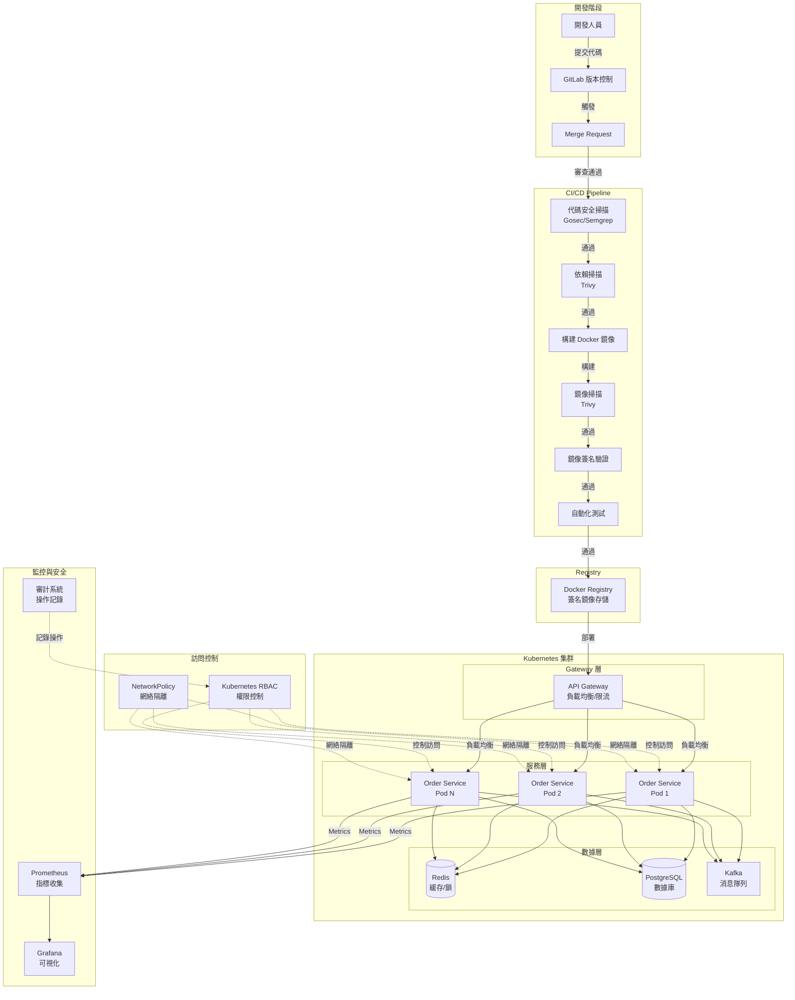
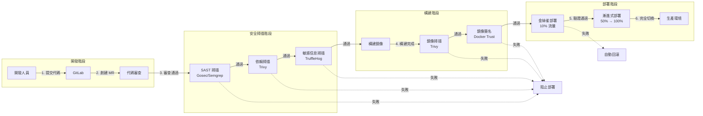
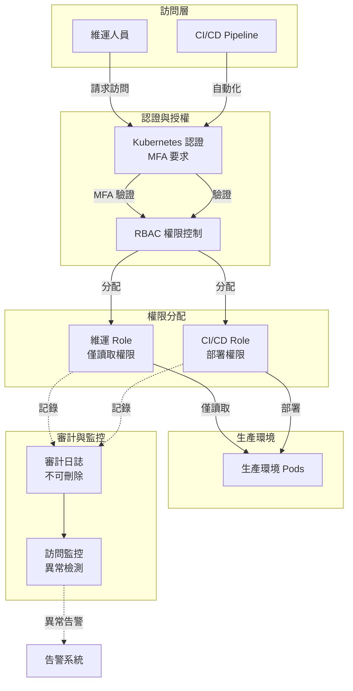
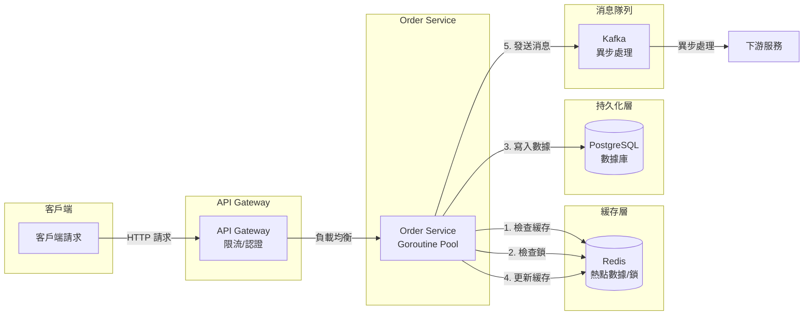

# 高併發注單服務 - 完整架構文檔

## 📋 架構概述

本系統是一個基於 Golang 的高併發注單服務架構，採用微服務設計，包含完整的 CI/CD 流程、安全掃描、訪問控制和監控體系。

## 🏗️ 完整架構圖

### 系統架構總覽



### CI/CD 流程架構



### 安全與訪問控制架構



### 數據流架構



## 🔧 核心組件詳解

### 1. 開發與版本控制

#### GitLab 版本控制
- **分支策略**：Git Flow（main, develop, feature, bugfix, release, hotfix）
- **代碼審查**：Merge Request 必須通過審查
- **CODEOWNERS**：自動分配審查責任人
- **保護分支**：main 分支禁止直接 Push

#### 稽核機制
- **自動記錄**：所有代碼變更自動記錄
- **審計日誌**：保留至少 1 年
- **合規性檢查**：Commit 格式、敏感信息檢測

### 2. CI/CD Pipeline

#### 安全掃描階段
1. **SAST（靜態代碼掃描）**
   - Gosec：Go 語言安全掃描
   - Semgrep：通用代碼安全掃描
   - TruffleHog：敏感信息掃描

2. **依賴掃描**
   - Trivy：檢測已知 CVE 漏洞
   - 檢查直接和間接依賴

3. **構建階段**
   - Docker 鏡像構建
   - 鏡像掃描（Trivy）
   - 鏡像簽名（Docker Content Trust）

#### 部署階段
1. **金絲雀部署**：10% 流量驗證
2. **漸進式部署**：50% → 100%
3. **自動回滾**：指標異常時自動回滾

### 3. 應用架構

#### API Gateway
- **功能**：統一入口、負載均衡、限流、認證
- **技術**：Golang + Gin
- **部署**：多實例，自動擴展

#### Order Service
- **功能**：注單處理服務
- **技術**：Golang + Goroutine Pool
- **特性**：
  - 高併發處理（1000 workers）
  - Token Bucket 限流
  - 異步處理（Kafka）
  - Redis 緩存

#### 數據層
- **PostgreSQL**：數據持久化
- **Redis**：緩存和分散式鎖
- **Kafka**：異步消息處理

### 4. 安全與訪問控制

#### Kubernetes RBAC
- **CI/CD Service Account**：僅用於自動化部署
- **維運人員 Role**：僅讀取權限
- **禁止操作**：寫入、刪除、執行、日誌訪問

#### 網絡隔離
- **NetworkPolicy**：限制網絡流量
- **僅允許**：Gateway 和監控系統訪問
- **禁止**：直接訪問數據庫

#### 審計日誌
- **記錄所有操作**：寫入、RBAC、Secrets 訪問
- **不可刪除**：存儲在外部系統
- **實時監控**：異常訪問檢測

### 5. 監控與可觀測性

#### Prometheus
- **指標收集**：QPS、延遲、錯誤率
- **業務指標**：注單處理成功率
- **系統指標**：CPU、內存、連接數

#### Grafana
- **可視化 Dashboard**：實時監控
- **告警規則**：自動告警
- **歷史數據**：趨勢分析

#### 審計系統
- **操作記錄**：所有變更記錄
- **訪問追蹤**：誰、何時、做了什麼
- **合規報告**：定期生成報告

## 🔄 完整流程

### 開發到部署流程

```
1. 開發階段
   ├─ 開發人員提交代碼到 feature 分支
   ├─ 創建 Merge Request
   └─ 代碼審查（至少 1-2 人）

2. 安全掃描階段
   ├─ SAST 掃描（Gosec, Semgrep）
   ├─ 依賴掃描（Trivy）
   ├─ 敏感信息掃描（TruffleHog）
   └─ 所有掃描必須通過

3. 構建階段
   ├─ 構建 Docker 鏡像
   ├─ 鏡像掃描（Trivy）
   ├─ 鏡像簽名（Docker Trust）
   └─ 推送到 Registry

4. 部署階段
   ├─ 金絲雀部署（10% 流量）
   ├─ 自動驗證（5-10 分鐘）
   ├─ 漸進式部署（50% → 100%）
   └─ 完全切換到生產環境

5. 監控階段
   ├─ 實時監控指標
   ├─ 異常檢測
   └─ 自動告警
```

### 安全控制流程

```
1. 訪問請求
   ├─ 維運人員請求訪問
   ├─ MFA 認證
   └─ RBAC 權限檢查

2. 權限分配
   ├─ 僅讀取權限（維運人員）
   ├─ 部署權限（CI/CD）
   └─ 禁止寫入和執行

3. 操作記錄
   ├─ 所有操作記錄到審計系統
   ├─ 實時監控異常訪問
   └─ 自動告警違規行為

4. 緊急訪問
   ├─ 提交審批請求
   ├─ Manager 審批
   ├─ 時間限制（1-4 小時）
   └─ 自動撤銷
```

## 📊 性能指標

### 系統性能
- **QPS**：100,000+
- **延遲**：P99 < 50ms
- **可用性**：99.95%+
- **並發連接**：10,000+

### 安全指標
- **代碼掃描覆蓋率**：100%
- **漏洞修復時間**：< 24 小時
- **審計日誌完整性**：100%
- **訪問違規檢測**：實時

## 🔒 安全措施總結

### 代碼安全
1. ✅ 自動化代碼掃描（SAST）
2. ✅ 依賴漏洞掃描
3. ✅ 敏感信息檢測
4. ✅ 鏡像安全掃描
5. ✅ 鏡像簽名驗證

### 訪問控制
1. ✅ Kubernetes RBAC 嚴格控制
2. ✅ 網絡隔離（NetworkPolicy）
3. ✅ 審計日誌（不可刪除）
4. ✅ 緊急訪問審批機制
5. ✅ 實時監控異常訪問

### 部署安全
1. ✅ 僅通過 CI/CD 部署
2. ✅ 金絲雀部署驗證
3. ✅ 自動回滾機制
4. ✅ 鏡像簽名要求
5. ✅ 多階段驗證

## 📁 文件結構

```
BettingService/
├── cmd/                          # 應用入口
│   ├── gateway/                  # API Gateway
│   └── order-service/            # 注單服務
├── internal/                     # 內部業務邏輯
│   ├── gateway/                  # Gateway 邏輯
│   ├── order/                     # 注單邏輯
│   └── common/                    # 共用工具
├── pkg/                          # 可重用包
│   ├── config/                   # 配置管理
│   ├── logger/                   # 日誌工具
│   └── metrics/                  # 監控指標
├── deploy/                       # 部署配置
│   ├── docker/                   # Docker 配置
│   └── kubernetes/               # K8s 配置
│       ├── rbac-production.yaml  # 生產環境 RBAC
│       └── audit-policy.yaml     # 審計策略
├── .gitlab/                      # GitLab 配置
│   ├── CODEOWNERS                # 代碼審查責任人
│   └── merge_request_templates/ # MR 模板
├── docs/                         # 文檔
│   ├── Architecture-Complete.md  # 完整架構文檔
│   ├── Deployment.md             # 部署策略
│   ├── Security-Scanning.md      # 安全掃描
│   └── Production-Access-Control.md # 訪問控制
├── scripts/                      # 腳本
│   ├── verify_canary.sh          # 金絲雀驗證
│   ├── gradual_rollout.sh        # 漸進式部署
│   ├── emergency-access-request.sh # 緊急訪問
│   └── monitor-production-access.sh # 訪問監控
├── .gitlab-ci.yml                # CI/CD 主配置
├── .gitlab-ci-audit.yml          # 稽核配置
└── .gitlab-ci-security.yml       # 安全掃描配置
```

## 🚀 快速開始

### 1. 設置 GitLab

```bash
# 設置分支保護規則
# 設置 CODEOWNERS
# 配置 CI/CD 變量
```

### 2. 部署基礎設施

```bash
# 部署 Kubernetes 集群
kubectl apply -f deploy/kubernetes/namespace.yaml

# 部署 RBAC 配置
kubectl apply -f deploy/kubernetes/rbac-production.yaml

# 部署審計策略
kubectl apply -f deploy/kubernetes/audit-policy.yaml
```

### 3. 配置 CI/CD

```bash
# 設置 Docker Content Trust
export DOCKER_CONTENT_TRUST=1

# 配置 GitLab CI/CD 變量
# - DOCKER_CONTENT_TRUST
# - AUDIT_API_TOKEN
# - SLACK_WEBHOOK_URL
```

### 4. 監控設置

```bash
# 部署 Prometheus
kubectl apply -f deploy/kubernetes/prometheus.yaml

# 部署 Grafana
kubectl apply -f deploy/kubernetes/grafana.yaml
```

## 📚 相關文檔

- [部署策略](Deployment.md)
- [安全掃描與訪問控制](Security-Scanning-and-Access-Control.md)
- [生產環境訪問控制](Production-Access-Control.md)
- [GitLab 版本控制與稽核](GitLab-版本控制與稽核.md)
- [API 文檔](API.md)

---

**最後更新**：2025-01-XX

