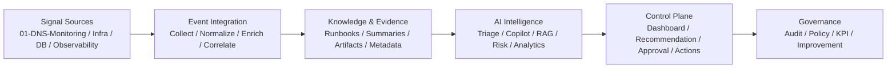
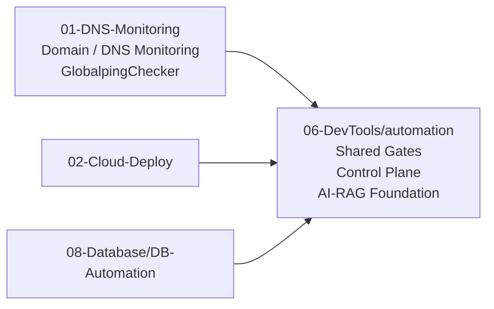

# Project Workspace

多專案維運自動化與 AIOps 工作區。  
A multi-project workspace for operations automation, governance, and AI-assisted decision support.

本工作區以 **Recommendation First、Evidence Driven、Human-in-the-loop** 為核心，
逐步將 DNS / Infra / DB / Observability 等營運訊號，整合進可治理的 Control Plane 與 AIOps 能力模型中。

---

## Architecture

---

## Workspace

---

## Domains / 專案領域

| Project | Role |
|---|---|
| `01-DNS-Monitoring` | DNS / Domain monitoring 主體，包含 `GlobalpingChecker` 與區域 DNS integrity 探測能力 |
| `02-Cloud-Deploy` | CI/CD、IaC、DNS/CDN、Network、Security automation skeleton |
| `08-Database/DB-Automation` | Backup、migration、monitoring、remediation、evidence workflows |
| `06-DevTools/automation` | Shared governance、control plane、AI/RAG foundation |

---

## Principles / 核心原則

- Recommendation first  
- Evidence driven  
- Human in the loop  
- Policy / execution separation  
- Full traceability  

---

## Direction / 發展方向

- unify operational signals / 整合多來源維運訊號
- standardize event language / 統一事件語言
- productize knowledge and evidence / 將知識與證據產品化
- enable traceable AI-assisted operations / 建立可追溯的 AI 輔助維運能力
- evolve toward governed AIOps execution / 演進為可治理的 AIOps 執行模式
